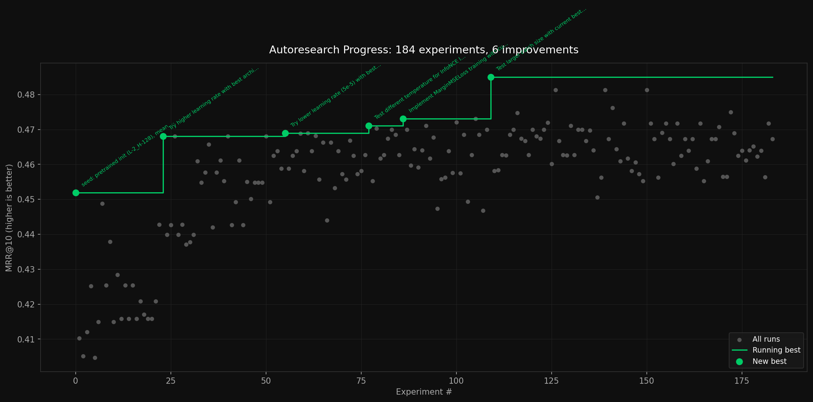

# Autoresearch

This autoresearch experiment is a local-only adaptation of [Andrej Karpathy's Autoresearch](https://github.com/karpathy/autoresearch).

For more info please see [the associated blog post](https://blog.lukesalamone.com/posts/autoresearch/).

## How it works

I opted for a fully local setup. Claude Code might have been better, but I wanted to control the costs of this experiment. Instead, I went with `qwen3-coder:30b` as the “researcher” and used the following scheduling loop:

1. Researcher checks prior experiment progress and proposes of 55 minutes of experiments, writing them into a todo log.
2. Experiments can have variable duration. It is up to the researcher to allocate time.
3. The researcher can also update train.py to accomodate new experiments.
4. There is a 5 minute time limit for the researcher, but I never hit it in practice.
5. Scheduler reads from todo log. Each experiment must have a duration, which is a pencils-down hard cutoff time
6. Scheduler runs experiments from the todo log, recording results to results.txt
7. Go back to step 1
